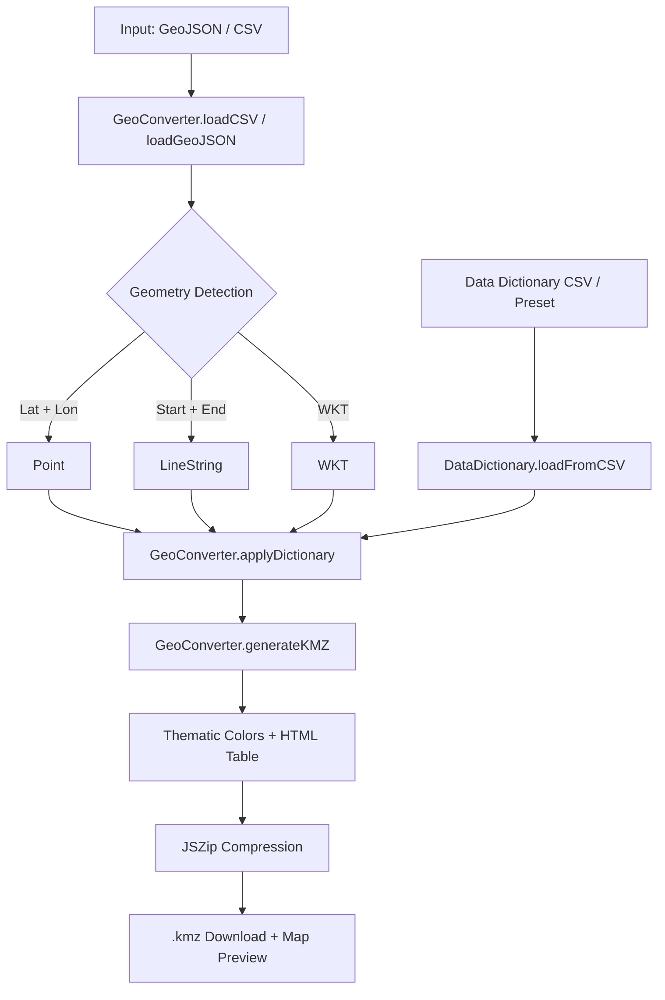

# irap2kmz

Client-side web app to convert ViDA iRAP geospatial data (CSV / GeoJSON) into styled, human-readable Google Earth KMZ files.

🔗 **Live App:** [https://steventrev.github.io/irap2kmz/](https://steventrev.github.io/irap2kmz/)  
*AI Disclosure: Developed with the assistance of Google's Gemini 3.8 Flash.*

---

## ✨ Features

- **Spatial Input:** Supports `.geojson`, `.json`, and `.csv`. Auto-detects Points (Lat/Lon), Line Segments (Start/End coords), and WKT geometries.
- **Code Translation:** Swaps integer codes (e.g. `11` → `Centre line`) using a 1-click built-in iRAP dictionary or custom CSVs.
- **KMZ Export:** Generates compressed `.kmz` files with Google Earth HTML balloon tables, GIS `<ExtendedData>`, and thematic styling (iRAP Star Ratings or custom colors).

---

## 🛠️ Data Dictionary Format

Custom dictionaries only require three columns (headers auto-detected):

| Item / Field | Code | Category / Definition |
| :--- | :--- | :--- |
| `Median type` | `11` | `Centre line` |
| `Median type` | `1` | `Safety barrier - metal` |
| `Road condition` | `1` | `Good` |
| `Roadside severity - driver-side object` | `13` | `Rigid structure or building` |
| `Area type` | `1` | `Rural` |

Fuzzy matching automatically aligns field variants like `27 _ Median type` and `Median type (code)` with `Median type`.


---

## 💻 Developer Guide

### 🚀 Commands

```bash
npm install         # Install dependencies
npm start           # Run local dev server (http://localhost:3000)
npm test            # Run conversion and unit tests
npm run build:dict  # Recompile iRAP dictionary from scripts/build_dictionary.js
```

### 🏗️ Data Pipeline

Client-side only; no backend required.



### 🧩 Core Modules

| Module | File | Purpose |
| :--- | :--- | :--- |
| **GeoConverter** | `js/geo-converter.js` | Parses spatial files, detects coordinates, generates KML/KMZ, and resolves Star Rating colors. |
| **DataDictionary** | `js/data-dictionary.js` | Fuzzy-matches column names and swaps numeric codes for labels. |
| **App Controller** | `js/app.js` | UI logic, file upload events, table viewer, and Leaflet preview. |
| **iRAP Preset** | `js/irap-dictionary.js` | Bundled ViDA lookup definitions (540+ mappings). |

### 🧪 Rules of Thumb
- **Single Source of Truth:** Keep GIS and color logic in `GeoConverter` (not in `app.js`).
- **Separation:** Keep DOM logic in `app.js`; data transforms in `geo-converter.js` or `data-dictionary.js`.
- **Test:** Always run `npm test` before committing.

